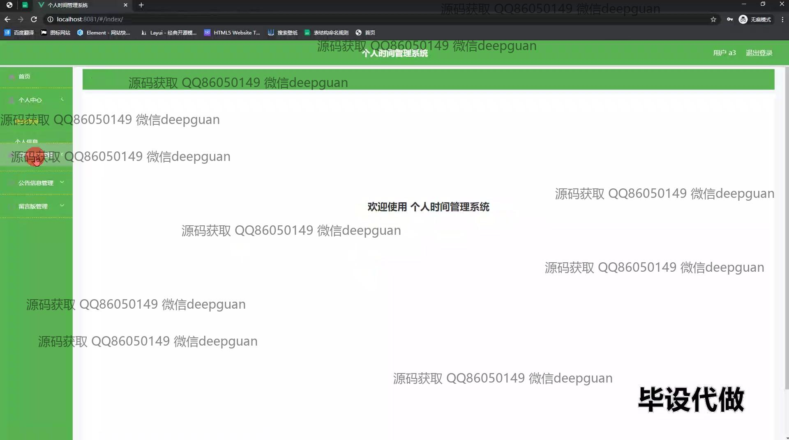
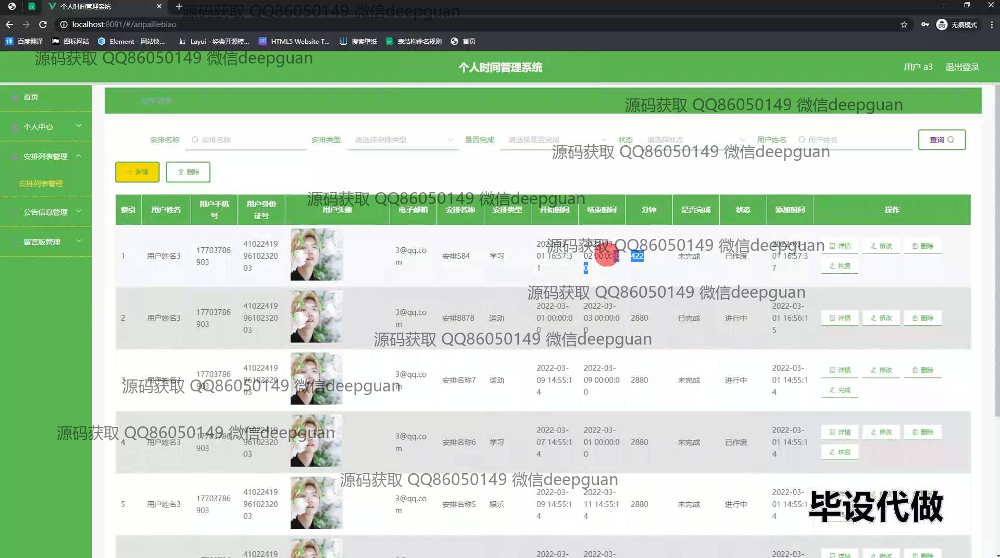

<h1 align="center">基于web 的个人时间管理系统+vue</h1>

## 简介
基于Web的个人时间管理系统：提供用户管理、安排管理、公告管理、任务状态更新和时间安排统计分析等功能，支持信息查询与修改，界面设计简洁，便于用户高效管理时间。    --计算机毕业设计源码；毕设源码；java毕业设计源码

## 联系方式

<h3 align="center">获取完整代码与数据库文件 + 微信：deepguan QQ: 86050149 QQ群: 783742310</h3>

<h3 align="center">可帮忙远程部署 包运行成功！提供远程部署、修改代码、设计文档指导、代码讲解等服务！</h3>

## 功能介绍（完整见运行截图）
管理员：管理网站用户的权限分配、增删改查和检索操作，以及管理系统公告和后台管理。支持任务安排的状态管理，包括对任务计划的详细信息的查看、编辑和删除。提供系统日志查看和用户操作记录，维持系统正常运作和数据备份。

用户：查看与自己相关的个人安排信息和管理日程，包括增加、删除和编辑安排任务。功能模块包含个人中心、公告查看、留言板功能、空闲时间管理等，支持根据需求对个人信息以及用户界面主题进行更改。可以通过查询条件筛选和管理自己的时间任务和获取时间分配的统计分析，以优化个人时间安排和规划。

## 运行截图

本代码来源于网络,仅供学习参考使用!

